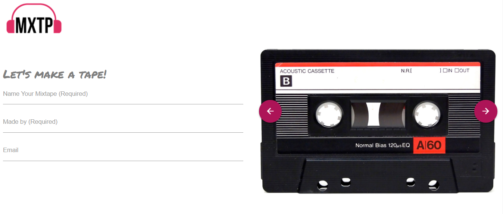

# Project Title:  MXTP

### Team Members:  Susan Davenport, Allen Welch, Eddie Rodriguez

#### GitHub URL:  https://github.com/allenjwelch/MXTP/
#### Deployed URL: https://allenjwelch.github.io/MXTP/
#### Original URL:  https://erodriguez87.github.io/mixtape/

## ToDo:
- Add Firebase integration for user sign-in/create account (to open new page for use to view all playlists)
- Add search feature to search for mixtapes by name
- Add share feature to email friends a link to your mixtape
- Add Toast alert when user clicks Save button before all mixtape requirements are met (mixtape name, user name, and 5 tracks in playlist)

### Project Description:
An intuitive application that allows users to create unique playlists + capture the old skool feeling of creating a mixtape, with a modern twist: YouTube Video Playback!

App includes song playback, album art, and information about the artist and album. The users will also be able to see playlists added by others. 

### Pseudocode:
The application will load to a starting page, it will have several mixtape images available to choose from for creating a playlist cover.

Users will be able to give their mixtape a name, enter their name, and email.

Once they select a track from the search, utilizing MusiXMatch, the app will add it to a playlist, up to 10 tracks.

Once songs are selected, user clicks “Mix” Button. User info and track list is saved to Firebase, the second page is opened and user is presented with final imaging and track list.

There is an image of the final tape chosen with the name of it written on top of the image. The songs will be to the right in table form

Using Last.FM, album and artist info for track playing will be shown when info button is hit. 

Clicking the YouTube button will search through the youtube API to find videos of the songs they add to the playlist (Video Button beside track).
